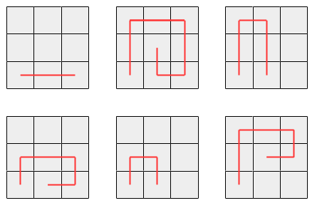

Problem D. Googlander

Problem

Eric Googlander is a fashion model who performs by walking around on a stage made of squares that form a grid with R rows and C columns. He begins at the leftmost bottom square, facing toward the top edge of the stage, and he will perform by making a series of moves. Googlander knows only the following two moves:

1. Take one step forward in the direction he is currently facing

2. Make a single 90 degree turn to the right, then take one step forward in the new direction he is facing following the turn

(Note that Googlander does not know how to make a 90 degree left turn.)

If a move would take Googlander off of the stage or onto a square he has already visited, that move is unfashionable. Whenever Googlander is in a position for which neither of the two possible moves is unfashionable, he is free to choose either move (independently of any other choices he has made in the past), but he must choose one of them. Whenever one of the possible moves he can make is unfashionable, he must make the other move. If at any point both of the possible moves are unfashionable, the show immediately ends without Googlander making another move. Note that Googlander cannot stop the show early -- he must keep moving until both possible moves become unfashionable.

How many different paths is it possible for Googlander to walk? (Two paths are the same if and only if they visit the same squares in the same order.)

Input

The first line of the input gives the number of test cases, T. T lines follow; each consists of two space-separated integers R and C.

Output

For each test case, output one line containing "Case #x: y", where x is the test case number (starting from 1) and y is the number of different paths that Googlander can walk.

Limits

1 ≤ T ≤ 100.
Small dataset

1 ≤ R, C ≤ 10.
The limits ensure that the answer will always fit in a 32-bit signed integer.

Large dataset

1 ≤ R, C ≤ 25.
The limits ensure that the answer will always fit in a 64-bit signed integer.

Sample

Input

3
1 1
1 3
3 3

Output

Case #1: 1
Case #2: 1
Case #3: 6

In Case #1, Googlander cannot make any moves. The only possible path is the trivial one consisting of the only square.

In Case #2, Googlander cannot take a step straight ahead, because it would take him off the stage, but he can turn right and then take a step. Once he has done so, he cannot turn right and then take a step, but he can take a step straight ahead. At that point, there are no more moves he can make and the show is over. This is the only possible path he can take.

In Case #3, these are the possible paths:

