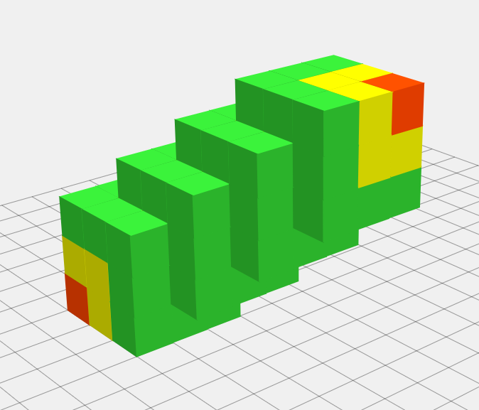

Lets think about R, G, and B as coordinates of small cubes. So all possible colors will create a big cube with (K+1) small cubes edge ( total possible colors = (K + 1) power 3).

####When V = 0
only diagonal cubes are bland
 Answer ( V, K ) = K + 1

 

####When V = 1
bland cubes are on the diagonal and every cube that 1 cube away from diagonal also will be bland.

To calculate how many cubes are on the "1 cube away" layer we can separate this layer into parallel to the diagonal lines. The length of this lines are one cube shorter than diagonal.

We can easily see that there will be 6 that kind of lines:

 Answer ( V, K ) = Answer(0, K) + 6 * K = (K + 1) + 6 * K

####When V = 2 and more
each next layer consist from 6 more lines than previos layer and the lines one cube shorter.  To visualise number of lines check out the first picture.

 Answer ( V, K ) = Answer(1, K) + 12 * (K - 1) = (K + 1) + 6 * K + 6 * 2 * (K - 1)

######V = 2:

####When V more than 2

 Answer ( V, K ) = Answer(V - 1, K) + 6 * V * (K - (V - 1) ) 
 Answer ( V, K ) = (K + 1) + 6 * K + 6 * 2 * (K - 1) + 6 * 3 (K - 2) + ... + 6 * V * (K - (V - 1) ) 
 Answer ( V, K ) = (K + 1) + 6 * { K + 2 * (K - 1) + 3 * (K - 2) + ... + V * (K - (V - 1) ) }
 Answer ( V, K ) = (K + 1) + 6 * { K + 2 * K - 2 + 3 * K - 3 * 2 + ... + V * K - V * (V - 1) }
 Answer ( V, K ) = (K + 1) + 6 * { (K + 2 * K + 3 * K + 4 * K + ... + V * K) - (2 + 3 * 2 + 4 * 3 + ... + V * (V - 1))}
 Answer ( V, K ) = (K + 1) + 6 * { K * ( 1 + 2 + 3 + ... + V ) - ( 1 * 2 + 2 * 3 + 3 * 4 + ... + (V - 1) * V )}
  ( 1 + 2 + 3 + ... + V ) = (V + 1) * V / 2 [sum of all natural numbers WIKI](http://en.wikipedia.org/wiki/1_%2B_2_%2B_3_%2B_4_%2B_%E2%8B%AF)
  ( 1 * 2 + 2 * 3 + 3 * 4 + ... + (V - 1) * V ) = ( 1 - 1) * 1 + (2 - 1) * 2 + ... + (V - 1) * V = (V -1) * V * (V + 1) / 3
  because it is sum of elemnts (n-1)*n :

 Answer ( V, K ) = (K + 1) + 6 * { [K * (V + 1) * V / 2]  - [ (V -1) * V * (V + 1) / 3 ] }
 Answer ( V, K ) = (K + 1) + [3 * K * (V + 1) * V] - 2 * [(V -1) * V * (V + 1)]
 Answer ( V, K ) = (K + 1) + (V + 1) * V * ( 3 * K - 2 * (V - 1) )
### Answer ( V, K ) = K + 1 + V * (V + 1) * (3 * K - 2 * V + 2)

Thank you for attention =) Please email mayyayt@gmail.com if you found an error.
